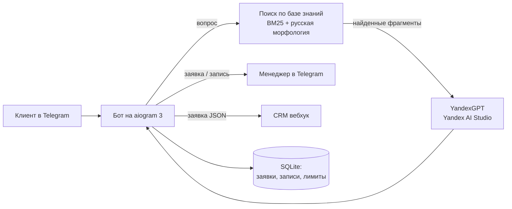

# Telegram-боты для бизнеса: AI-ассистент продаж и онлайн-запись

Два готовых решения в одном боте. Попробовать вживую: **[@system676_bot](https://t.me/system676_bot)**

| Сценарий | Ссылка | Для кого |
|---|---|---|
| 🤖 AI-ассистент продаж | [t.me/system676_bot?start=sales](https://t.me/system676_bot?start=sales) | компании, где менеджеры тонут в одинаковых вопросах клиентов |
| 📅 Онлайн-запись | [t.me/system676_bot?start=booking](https://t.me/system676_bot?start=booking) | салоны, барбершопы, клиники, сервисы с записью по времени |

Компании в демо вымышленные (студия кухонь «Форма», барбершоп «Blade»).

## Что умеет

**AI-ассистент продаж**
- Отвечает клиентам 24/7 по базе знаний компании: цены, сроки, материалы, оплата, гарантия.
- Не выдумывает: ищет нужные фрагменты в базе знаний (RAG) и отвечает только по ним. Если ответа нет, честно говорит об этом и предлагает оставить заявку.
- Квалифицирует заявку за 4 вопроса: что нужно, бюджет, сроки, контакт. Оценивает её как горячую, тёплую или холодную по понятным правилам.
- Мгновенно передаёт заявку менеджеру в Telegram и, при настройке, в CRM (amoCRM, Битрикс24 и другие) через вебхук.
- Защита бюджета на LLM: дневной лимит вопросов на пользователя. Защита от попыток «переписать инструкции» в сообщении.

**Онлайн-запись**
- Клиент сам выбирает услугу, мастера, день и свободное время. Занятые слоты не показываются, двойная запись исключена даже при одновременных нажатиях.
- Напоминание клиенту за 2 часа до визита, отмена записи в один клик.
- Администратор получает уведомления о новых записях и отменах, смотрит расписание командой `/admin` и выгружает его в Excel командой `/export`.

## Как устроено



- **База знаний** — обычные Markdown-файлы в `knowledge/`. Компания редактирует их сама, без программиста. Для базы на десятки страниц векторная БД не нужна: поиск BM25 с учётом русских окончаний находит нужный раздел за микросекунды.
- **LLM** — YandexGPT через OpenAI-совместимый API Yandex AI Studio: работает из России, оплата в рублях. Если ключ не задан или API недоступен, бот отвечает найденным фрагментом базы и не замолкает.
- **Данные** — SQLite в Docker-томе. Для нагрузки в тысячи пользователей в день этого достаточно; перевод на PostgreSQL — замена одного модуля.

## Быстрый старт

```bash
cp .env.example .env      # BOT_TOKEN, MANAGER_CHAT_ID, YANDEX_API_KEY, YANDEX_FOLDER_ID
docker compose up -d
docker compose logs -f
```

Готовый образ публикуется в GitHub Container Registry: `ghcr.io/vladislavscv/telegram-business-bots:latest`.

Сервер в России, где `api.telegram.org` недоступен: укажите в `TELEGRAM_API_URL` адрес зеркала Bot API (например, Cloudflare Worker).

### Настройки

| Переменная | Назначение |
|---|---|
| `BOT_TOKEN` | токен бота от @BotFather |
| `MANAGER_CHAT_ID` | Telegram ID менеджера: получает заявки, записи и доступ к `/admin` |
| `YANDEX_API_KEY`, `YANDEX_FOLDER_ID`, `YANDEX_MODEL` | доступ к YandexGPT |
| `CRM_WEBHOOK_URL` | куда отправлять заявки в формате JSON |
| `DAILY_QUESTION_LIMIT` | вопросов к ассистенту на пользователя в день |
| `REMINDER_BEFORE_MINUTES` | за сколько минут напоминать о записи |
| `TELEGRAM_API_URL` | зеркало Bot API для серверов в РФ |
| `OWNER_CONTACT` | ссылка для кнопки «Хочу такой бот» |

### Как адаптировать под свою компанию

1. Заменить файлы в `knowledge/` на свои: прайс, условия, FAQ. Можно подключить папку томом без пересборки (см. `docker-compose.yml`).
2. Поправить роль ассистента в `bot/llm.py` (`SYSTEM_PROMPT`) и вопросы квалификации в `bot/leads.py`.
3. Для записи — услуги, мастера и часы работы в `bot/booking.py`.
4. Указать `CRM_WEBHOOK_URL`: заявка придёт туда со всеми полями.

## Разработка

```bash
pip install -e '.[dev]'
ruff check . && pytest
```

Тесты покрывают поиск по базе знаний, запрос к YandexGPT и запасной режим, расчёт свободных слотов, защиту от двойной записи, напоминания, а также сквозные сценарии: настоящий диспетчер aiogram получает сообщения и нажатия кнопок, ответы бота проверяются.

CI (GitHub Actions): линтер и тесты на каждый push, сборка и публикация Docker-образа в ghcr.io из ветки `main`.

## Лицензия

MIT
